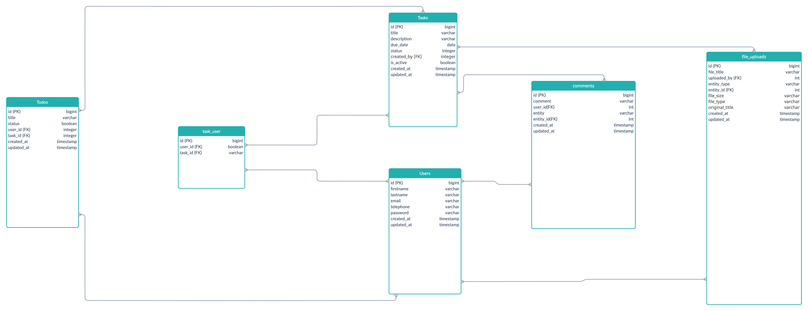

[](https://packagist.org/packages/phpunit/phpunit)
[](https://packagist.org/packages/phpunit/phpunit)
<a href="https://packagist.org/packages/laravel/framework"></a>

# Taskshare
This is the Backend code for Task Management App using Laravel. This app is for coding beginners who are learning how to create REST API using Laravel. It can also be used by frontend developers to have a backend for their frontend task management app.

#### How The App Works
   A user can create a task with multiple todos, which can be used to determine the progress of the task. Members of a task can also add comment to collaborate on a mutual task.

## Prerequisites: 
Before running this code locally, ensure you have:
  - Environment - PHP 8.0> and Composer installed.
  - Database - MySQL.
  - Postman or any API testing tool installed for testing endpoints.

## Installations
  1. Clone the Task Management App API repository from GitHub.

      ```bash
      git clone https://github.com/aminubarade/TaskManagementApp-API.git
#
  2. Navigate to the project directory.

      ```bash
      cd TaskManagementApp-API
#
  3. Install project dependencies using Composer.

      ```bash
      composer install
#
  4. Set up the environment variables by creating a .env file based on the provided .env.example file and update the variables according to your environment.

      ```bash
      cp .env.example .env
#
  5. Start the application.

      ```bash
      php artisan serve
#
  6. Access the API endpoints at http://localhost:8000.
#

## Available APIs

## Authentication Endpoints

#### Register User

  - **Method:** POST
  - **Endpoint:** `/api/register`
  - **Parameters:**
    - `username` (string): User's username.
    - `firstname` (string): User's First name.
    - `lastname` (string): User's Last name.
    - `phone` (integr|length 10): User's phone number.
    - `email` (string): User's email address.
    - `address` (string): User's contact address.
    - `password` (string): User's password.

  #### Login User

  - **Method:** POST
  - **Endpoint:** `/api/login`
  - **Parameters:**
    - `username` (string): User's email address.
    - `password` (string): User's password.

  #### Logout User
  - **Method:** POST
  - **Endpoint:** `/api/logout`
  - **Parameters:** null
  - **Authentication:** Requires a valid Passport token obtained after login.

## User Management Endpoints

#### Get All Users

- **Method:** GET
- **Endpoint:** `/api/users/`
- **Authentication:** Requires a valid Passport token obtained after login.

#### Get a Specific User

- **Method:** GET
- **Endpoint:** `/api/users/view/:id`
- **Parameters:**
  - `id` (integer): ID of the user.
- **Authentication:** Requires a valid Passport token obtained after login.

#### Update User

- **Method:** PUT
- **Endpoint:** `/api/users/update/:id`
- **Parameters:**
  - `username` (string): User's username.
  - `firstname` (string): User's First name.
  - `lastname` (string): User's Last name.
  - `phone` (integr|length 10): User's phone number.
  - `email` (string): User's email address.
  - `address` (string): User's contact address.
- **Authentication:** Requires a valid Passport token obtained after login.

#### Delete user

- **Method:** DELETE
- **Endpoint:** `/api/users/delete/:id`
- **Parameters:**
  - `id` (integer): ID of the task to delete.
- **Authentication:** Requires a valid Passport token obtained after login.

## Task Management Endpoints

#### Create Task

- **Method:** POST
- **Endpoint:** `/api/tasks/create`
- **Parameters:**
  - `title` (string): Task title.
  - `description` (string): Task description.
  - `dueDate` (date): Task due date.
  - `assign_to` (array of integer;user IDs): Assign task to users (Optional)
- **Authentication:** Requires a valid Passport token obtained after login.

#### Get All Tasks

- **Method:** GET
- **Endpoint:** `/api/tasks/`
- **Authentication:** Requires a valid Passport token obtained after login.

#### Get a Specific Task

- **Method:** GET
- **Endpoint:** `/api/tasks/view/:id`
- **Parameters:**
  - `id` (integer): ID of the task.
- **Authentication:** Requires a valid Passport token obtained after login.

#### Update Task

- **Method:** PUT
- **Endpoint:** `/api/tasks/update/:id`
- **Parameters:**
  - `id` (integer): ID of the task to update.
  - `title` (string): New title of the task.
  - `description` (string): New description of the task.
  - `dueDate` (date): New due date of the task.
  - `assign_to` (array of integer;user IDs): Assign task to users (Optional)
- **Authentication:** Requires a valid Passport token obtained after login.

#### Delete Task

- **Method:** DELETE
- **Endpoint:** `/api/tasks/delete/:id`
- **Parameters:**
  - `id` (integer): ID of the task to delete.
- **Authentication:** Requires a valid Passport token obtained after login.

#### Disable Task

- **Method:** PATCH
- **Endpoint:** `/api/tasks/disable-task/:id`
- **Parameters:**
  - `id` (integer): ID of the task to disable.
  - `is_active` (boolean): To disable the task.
- **Authentication:** Requires a valid Passport token obtained after login.

#### Update Task Status

- **Method:** PATCH
- **Endpoint:** `/api/tasks/update-status/:id`
- **Parameters:**
  - `id` (integer): ID of the task to update.
  - `status` (integer): New status of the task (e.g., "Completed", "In Progress").
- **Authentication:** Requires a valid Passport token obtained after login.

## Todo Endpoints

#### Add Todo to Task or Create Independent Todo

- **Method:** POST
- **Endpoint:** `/api/todos/create`
- **Parameters:**
  - `title` (string): Text of the todo.
  - `task_id` (string): ID of the task to add the todo to.
- **Authentication:** Requires a valid Passport token obtained after login.

#### Update Todo

- **Method:** PUT
- **Endpoint:** `/api/todos/update/:todoId`
- **Parameters:**
  - `todoId` (integer): ID of the todo to update.
  - `title` (string): New title of the todo to update.
- **Authentication:** Requires a valid Passport token obtained after login.

#### Update Todo Status

- **Method:** PATCH
- **Endpoint:** `/api/todos/update-status/:todoId`
- **Parameters:**
  - `todoId` (integer): ID of the todo to update.
  - `status` (boolean): Status of the todo to update (1. Complete 0. Incomplete).
- **Authentication:** Requires a valid Passport token obtained after login.

#### Delete Todo

- **Method:** DELETE
- **Endpoint:** `/api/todos/delete/:todoId`
- **Parameters:**
  - `todoId` (integer): ID of the todo.
- **Authentication:** Requires a valid Passport token obtained after login.

## Database Schema


## Testing

1. Use Postman or any API testing tool to test the endpoints.
2. Register a new user using the `/api/users/register` endpoint.
3. Login with the registered user using the `/api/users/login` endpoint to obtain a Laravel Passport token.
4. Use the obtained JWT token to access protected endpoints requiring authentication.

## Security Considerations

Ensure proper authentication and authorization mechanisms are in place to secure the endpoints and prevent unauthorized access to user data, tasks, and todos.

## Error Handling

Handle errors and exceptions gracefully by returning appropriate HTTP status codes and error messages in the response.

#### Built with
  1. Framework - Laravel Version 9.52.16
  2. Database architecture - Eloquent


# Upcoming Feature
  1. Notifications
  2. Permissions
  3. File attachments
  4. Password reset
  5. Comments


